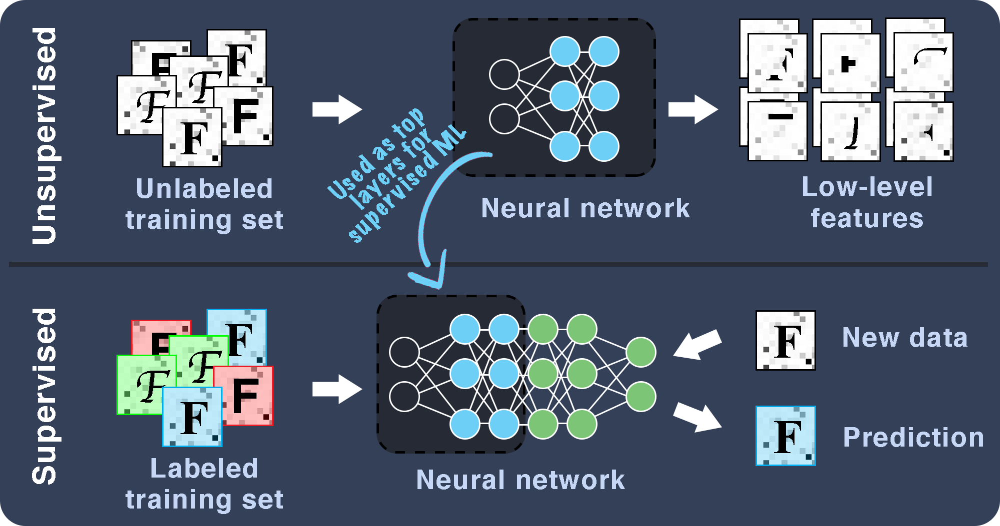



_**The style of texts also carries imformation.**_

## Project Introduction
OCR (optical character recognition) technology that converts images and scanned documents into texts is mature with a high accuracy. It is also widely accessible to the public being embedded in software such as Adobe Acrobat. For such scanned document to text conversion, it is shown that recognizing individual letters rather than the whole words is more efficient [1]. However, letters can have different fonts and that information is not generally preserved during the recognition process, meaning users need to reformat the whole document from scratch. This is inconvenient and can possibly introduce human errors in editing. Thus, we propose to combine supervised and unsupervised machine learning to recognize and distinguish typefaces of characters in scanned documents.
	
Meanwhile, there are apps that specifically target the font recognitions. For example, the app WhatTheFont uses deep learning algorithms trained on 33 million images to recognize 100 thousand fonts [2]. However, the app is tailored towards scanned documents, and for cases where we test with hand-drawn characters, the app returns similar handwritten fonts (thanks to its large collection) instead of similar standard publication fonts that are ready for production. In this sense, the large collection actually hinders people's ability to fast-prototype using pen and paper. To empower artists, designers and editors, we are also proposing to use our trained program for matching the hand-drawn characters with standard fonts.

## Proposed Method

The training sets consist of a number of computer generated images of letters (A to Z) with different typefaces. This enables collecting a large amount of samples efficiently. To mimic the real-life data, which are scanned or drawn letters, degraded letter stimuli is included by adding random Gaussian noises to images [1]. (Note that even though the training sets are software-generated, real-life data will be used to test the performance of the program.)

Both supervised and unsupervised methods can be used for this task [2, 3, 4]. This project proposes to compare two methods: convolutional neural network (CNN) and Random Forest.  Since CNN takes long time for training, we will be using an esiting pre-trained CNN model. For random forest alogithm, we will be using SKlearn libray in Python [5]. The unsupervised neural network will be used to derive low-level feature information from an unlabeled data set. The supervised neural network will then use those low-level layers with feature information to classify labeled data into different typefaces.

Due to the complexity of the task, we will train on 3 distinct typefaces as a proof of concept.

## Anticipated Results

- The final goal is to recognize and distinguish at least 3 typefaces.

- We expect the program to be able to give predictions of typefaces of scanned images of charaters.

- The program should also be able to match hand-drawn characters with similar typefaces.

- A high accuracy of is expected. However, the accuracies of different letters are expected to be different as some letters are more distinct among typefaces than others.

## Discussion
### Impact

The best outcome of this project would be a spin-off app that can recognize selected typefaces accurately from a scanned document or hand-drawn characters. This would help many people who wants to recreate digital versions of scanned documents while the format needs to be preserved, or when they want to indentify the hand-drawn characters to the closest matching standard fonts. We expect this program to find its use in publication and design industries.

### Next Steps

The project will lay solid fundation for future works. Some clear extensions that can be implemented are:

- Expanding to more typefaces;

- Adapting into plug-ins for exsiting softwares, such as Adobe Acrobat;

- Adding detections of other aspects of fonts, such as color, size, highlight, bold, italic, and underscore. 

## References
[1] Pelli, Denis G., et al. “The Remarkable Inefficiency of Word Recognition.” Nature, vol. 423, no. 6941, 2003, pp. 752–756., doi:10.1038/nature01516.

[2] Schwab, Katharine. “This App Uses Machine Learning To Identify Esoteric Fonts.” Fast Company, Fast Company, 9 July 2018, www.fastcompany.com/90149756/this-app-uses-machine-learning-to-identify-esoteric-fonts.

[3] Yang, Jianchao, et al. Font Recognition and Font Similarity Learning Using a Deep Neural Network. 22 Nov. 2016.

[4] Wang, Zhangyang, et al. “DeepFont: Identify Your Font from An Image.” Proceedings of the 23rd ACM International Conference on Multimedia - MM ‘15, 2015, doi:10.1145/2733373.2806219.

[5] “3.2.4.3.1. Sklearn.ensemble.RandomForestClassifier¶.” Scikit, scikit-learn.org/stable/modules/generated/sklearn.ensemble.RandomForestClassifier.html.

